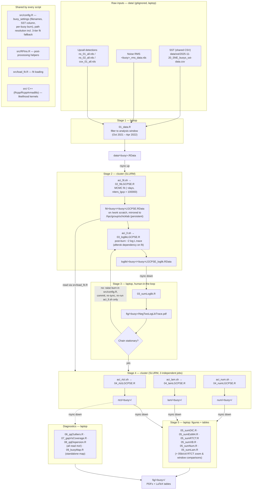

# sne_ns01 data flow

How data moves through the LGCPSE pipeline, from raw buoy files to
figures and tables. Everything is parallel over the buoy axis
(`ns01 | ns02 | cox01`); each box below runs once per buoy.

## Key mechanics

- **Buoy is the parallelism axis.** Every script takes `--buoy=<b>` or
  `BUOY=<b>`; per-buoy constants (raw filenames, SST column, burn) are
  pinned in `buoy_settings` in `src/config.R`.
- **The laptop/cluster split exists because of stage 3.** The burn-in
  traceplot is a human decision point: edit `burn` in `src/config.R`,
  re-sync, and re-run only the cheap loglik job — the fit itself is
  unaffected by a burn change.
- **Fit storage has a 75-day clock.** `/work/rss10/sne_ns01/` (scratch)
  is wiped after 75 days; `02_fitLGCPSE.R` mirrors finished fits to
  `/hpc/group/schicklab/sne_ns01/fit/<buoy>/`. `src/config.R` resolves
  `path.fit` scratch → share → local `./fit/`, so the same code runs
  anywhere. All other artifact dirs (`loglik/`, `rtct/`, `lam/`,
  `num/`, `fig/`, `data/`) are always local to the working directory
  and moved by rsync.
- **Side pipelines** not on the critical path: `benchmark_*` /
  `run_laptop_benchmark.sh` (GP-resolution benchmarking),
  `RScripts/` sun-time utilities (`calc_suntimes.R`,
  `plot_suntimes.R`, `minute_histogram.R`), and `proto_spline/`.
